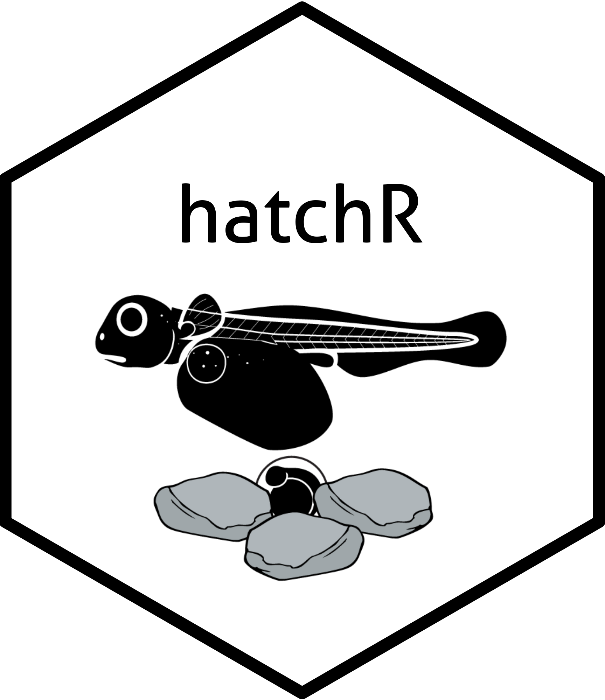

# Effective value models for non-fish poikilotherms

hatchR is a software ecosystem that allows users to parameterize developmental phenology models for poikilotherms and apply them to *in situ* thermal regimes typical of wild environments. hatchR was built specifically for fishes, however this project extends applicability to other poikilotherms.

hatchR can be downloaded from CRAN using `install.packages("hatchR")`. It is also available as a point and click Shiny app. Information about the package, Shiny app, and numerous examples of how to use the software are available at the package website (<https://bmait101.github.io/hatchR/index.html>).
